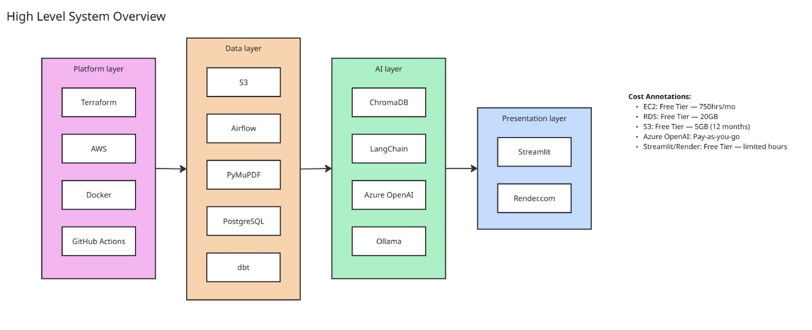
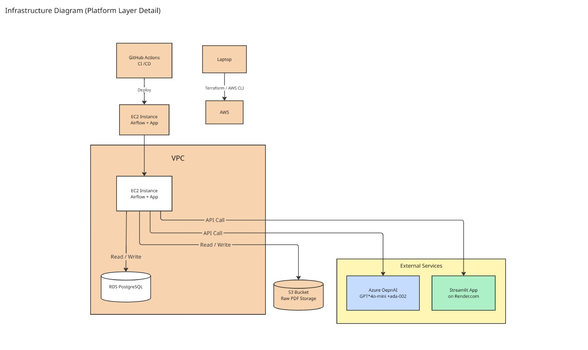
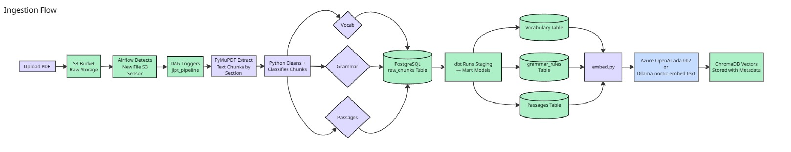
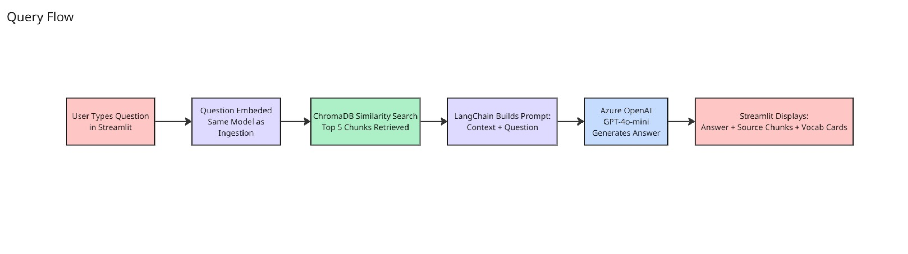
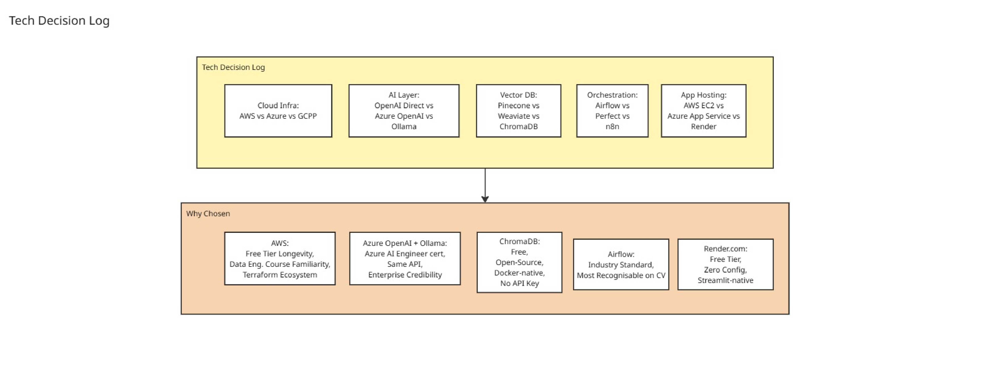

# 🌸 Sakura Stack

> An AI-powered Japanese language learning platform built to demonstrate 
> end-to-end Data Engineering, Platform Engineering, and Applied AI Engineering.

**Live demo:** [coming soon — deploying Week 10]  
**Status:** 🚧 In active development  
**JLPT target:** N3 (July 2025) → N2 → N1

---

## What it does

Sakura Stack ingests JLPT study materials (PDFs), processes them through 
an automated data pipeline, and serves an AI tutor that answers Japanese 
language questions grounded in those materials — not hallucinated.

Ask it: *"Explain the difference between は and が"* and it retrieves the 
relevant passage from your actual study materials before answering.

---

## Architecture

<details>
<summary>Click to expand architecture diagrams</summary>

### Overview


### Infrastructure Layer


### Data Flow


### AI Layer


### Technology Decisions


</details>

**Stack decision:** AWS for infrastructure and data layers (Terraform, 
EC2, S3, RDS). Azure OpenAI for the AI layer — deliberately chosen to 
activate Azure AI Engineer certification in a real project context and 
reflect real enterprise multi-cloud environments.

---

## Tech Stack

| Layer | Purpose | Technologies |
|-------|---------|-------------|
| Platform | Infrastructure as Code + CI/CD | Terraform, Docker, GitHub Actions, AWS |
| Data | Pipeline, storage, transformation | Apache Airflow, PyMuPDF, PostgreSQL, dbt |
| AI | RAG + LLM | LangChain, ChromaDB, Azure OpenAI (GPT-4o-mini) |
| App | User interface | Streamlit, Render.com |

---

## Project Structure
```
sakura-stack/
├── infra/        # Terraform — AWS infrastructure
├── data/         # Airflow DAGs + dbt models + ETL scripts  
├── ai/           # RAG pipeline + prompt templates
├── app/          # Streamlit application
└── docs/         # Architecture diagrams + decisions
```

---

## Why I built this

I'm preparing for JLPT N3 (July 2025) and wanted a study tool that 
actually uses *my* materials, not generic flashcard apps. Building it 
as a full-stack engineering project meant I could simultaneously 
demonstrate data pipeline design, infrastructure automation, and applied 
AI in one coherent system.

The pipeline is designed to scale — passing N3 means adding N2 PDFs 
to the same pipeline with zero code changes.

---

## Running locally

*(instructions coming — Week 2)*

---

## What I learned

*(updated as project progresses)*

---

## Roadmap

- [x] Project scaffolding + README
- [ ] Terraform: S3 + EC2 + RDS provisioned
- [ ] Docker Compose: local environment
- [ ] GitHub Actions CI/CD
- [ ] PDF extraction pipeline (PyMuPDF)
- [ ] Airflow DAG: end-to-end pipeline
- [ ] dbt models: vocabulary + grammar
- [ ] ChromaDB: vector embeddings
- [ ] RAG chain: LangChain + Azure OpenAI
- [ ] Streamlit UI: chat + vocab cards
- [ ] Live deployment: Render.com
