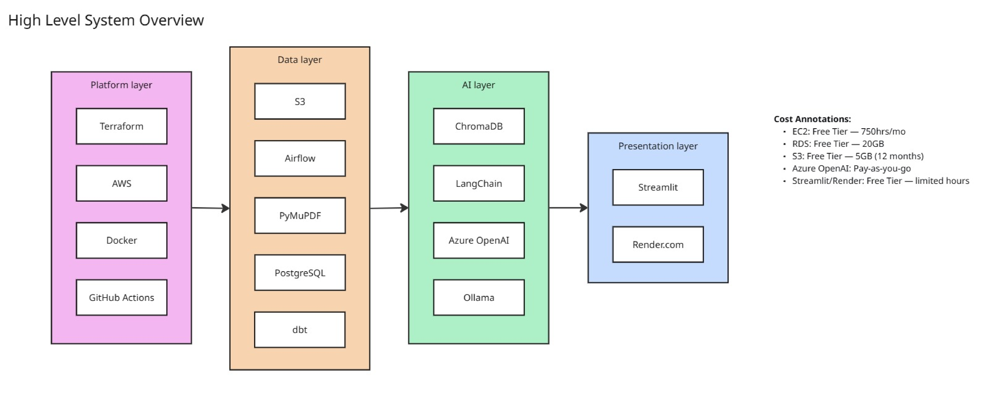
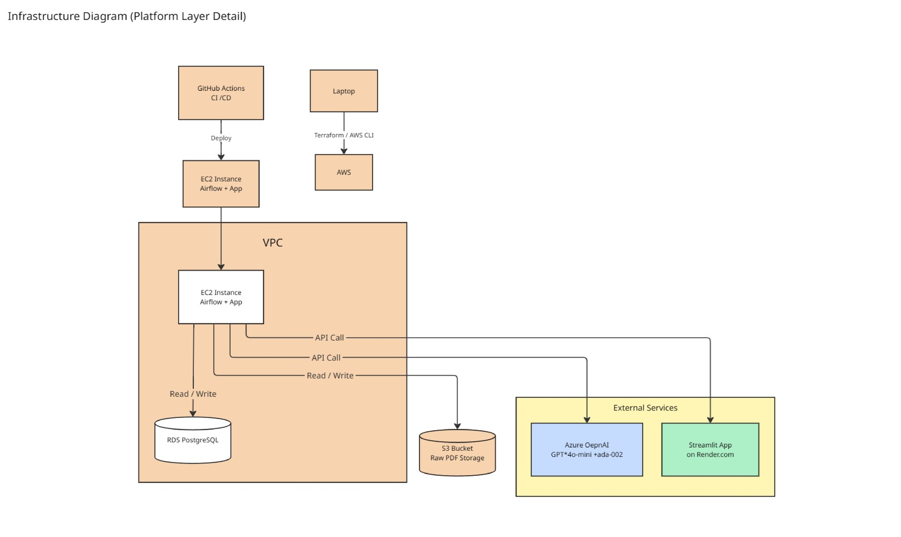
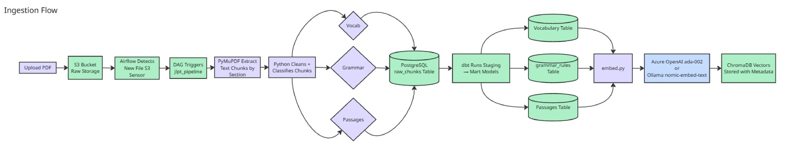
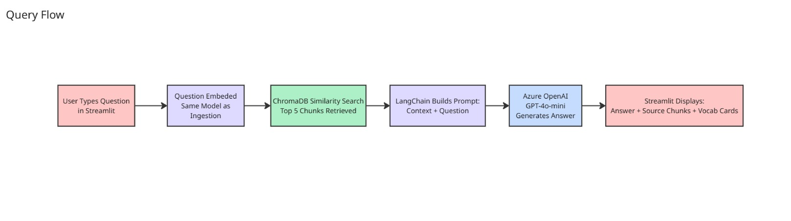
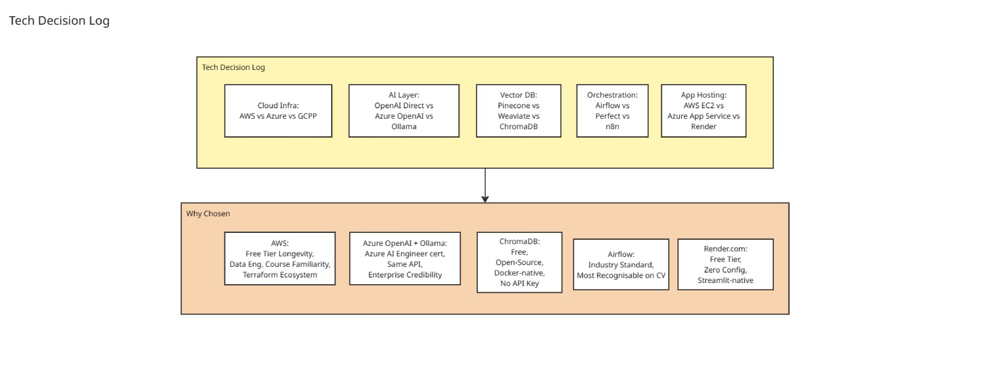

# 🌸 Sakura Stack

> An AI-powered Japanese language learning platform built to demonstrate
> end-to-end Data Engineering, Platform Engineering, and Applied AI Engineering.

**Status:** 🚧 Active development — Phase 3 (RAG) working, Phase 4 (UI) next
**JLPT target:** N2 (December 2026)
**Live demo:** coming soon

---

## What it does

Sakura Stack ingests JLPT study materials, processes them through an
automated data pipeline, and serves an AI tutor that answers Japanese
language questions grounded in those materials — not hallucinated.

Ask it: *"What is the difference between みたい and らしい?"* and it
retrieves the relevant passages from your actual study materials before
answering.

---

## Architecture

<details>
<summary>Click to expand architecture diagrams</summary>

### Overview


### Infrastructure Layer


### Data Flow


### AI Layer


### Technology Decisions


</details>

---

## Tech Stack (as built)

| Layer | Purpose | Technologies |
|-------|---------|-------------|
| Platform | Containerisation + CI/CD | Docker, Docker Compose, GitHub Actions |
| Data | Storage, transformation, orchestration | PostgreSQL, dbt, Apache Airflow (Docker) |
| AI | Embeddings + RAG | ChromaDB, Ollama (Mistral + nomic-embed-text) |
| App | User interface | Streamlit (in progress) |
| Cloud (planned) | Infrastructure as Code | Terraform, AWS S3, EC2, RDS |

### Original plan vs. what shipped

This project started with a plan that included Azure OpenAI and AWS RDS.
As the project progressed, pragmatic decisions were made:

| Planned | Actually Used | Reason |
|---------|---------------|--------|
| PyMuPDF PDF extraction | Replit pre-processed data | PDF extraction produced ~8% of expected grammar content from complex Japanese textbooks; sourced higher-quality data instead |
| Azure OpenAI (GPT-4o-mini) | Ollama (Mistral 7B) locally | Zero API cost, offline capability, no vendor lock-in for portfolio demo |
| LangChain orchestration | Direct ChromaDB + Ollama SDK | Simpler, fewer dependencies, fully transparent retrieval |
| Airflow from day one | Airflow added post-MVP | Prioritised working product; orchestration layer designed and deferred |
| AWS RDS PostgreSQL | Local Docker PostgreSQL | Cost-conscious for portfolio phase; Terraform config ready for deployment |
| JLPT N3 target | JLPT N2 target | Adjusted after N3 result — same pipeline supports N2 with zero code changes |

---

## Project Structure
sakura-stack/
├── infra/ # Terraform — AWS infrastructure (planned)
├── data/ # ETL scripts, dbt models, loaders
│ ├── extract.py
│ ├── load_vocab_grammar.py
│ └── dbt_jlpt/ # dbt project
├── dags/ # Airflow DAGs
├── ai/ # RAG pipeline
│ ├── embed.py
│ └── rag.py
├── app/ # Streamlit application (in progress)
└── docs/ # Architecture diagrams


---

## Data Summary

| Table | Rows | Purpose |
|-------|------|---------|
| `raw_chunks` | 2,405 | Source text chunks for RAG |
| `vocabulary` | 1,157 | N2 vocabulary items |
| `grammar_rules` | 275 | N2 grammar patterns |
| `mart_study_items` (dbt) | 1,432 | Unified view for the UI |

---

## How the pipeline works

1. **Ingestion** — JLPT study materials (PDFs → text → structured JSON)
2. **Storage** — PostgreSQL (`raw_chunks`, `vocabulary`, `grammar_rules`)
3. **Transformation** — dbt models: staging → marts with 9 passing tests
4. **Embedding** — 2,405 chunks embedded via nomic-embed-text → ChromaDB
5. **Retrieval** — ChromaDB semantic search returns top-K relevant chunks
6. **Generation** — Mistral 7B generates grounded answers with source citations
7. **Serving** — Streamlit UI (in progress)

---

## Why I built this

Preparing for JLPT N2 and wanted a study tool that uses **my** materials,
not generic flashcard apps. Building it as a full-stack engineering project
meant demonstrating data pipeline design, infrastructure automation, and
applied AI in one coherent system.

The pipeline is designed to scale — adding N2 PDFs means dropping files
into a folder and running the same DAG with zero code changes.

---

## Roadmap (updated)

### ✅ Phase 1 — Platform Foundation
- [x] Project scaffolding, README and architecture diagrams
- [x] Docker Compose: local PostgreSQL + ChromaDB
- [x] Python virtual environment + dependencies
- [x] GitHub Actions CI/CD pipeline

### ✅ Phase 2 — Data Engineering
- [x] PDF extraction script (initial attempt; pivoted to Replit data)
- [x] PostgreSQL schema: raw_chunks, vocabulary, grammar_rules, passages
- [x] Data loaders (`load_vocab_grammar.py`, `load_replit_data.py`)
- [x] dbt project with staging + mart models
- [x] 9 dbt data quality tests passing
- [x] dbt docs generated (data catalog)

### ✅ Phase 3 — AI Layer
- [x] Ollama installed (Mistral 7B + nomic-embed-text)
- [x] ChromaDB: 2,405 chunks embedded
- [x] RAG query system (`ai/rag.py`)
- [x] Working end-to-end grounded question answering

### 🚧 Phase 4 — UI and Deployment (in progress)
- [ ] Streamlit UI: chat interface
- [ ] Vocabulary / grammar browse tabs
- [ ] Pipeline status dashboard
- [ ] Deployment to Render.com
- [ ] Loom walkthrough video

### ⏸️ Phase 5 — Orchestration & Cloud (deferred)
- [ ] Airflow DAG operational (infrastructure already in Docker)
- [ ] Terraform: S3 bucket, EC2, RDS provisioned
- [ ] AWS deployment of full stack

---


## AWS Infrastructure (Terraform, deliberately not deployed)

The `infra/` folder contains complete Terraform configuration for:
- VPC with public/private subnets
- S3 bucket for raw PDF storage
- EC2 instance for pipeline execution
- RDS PostgreSQL for the production database
- IAM roles and security groups

**Status:** Infrastructure-as-Code complete and validated. Not actively
deployed — validated the design (`terraform plan`), then destroyed
(`terraform destroy`) to avoid ongoing cloud costs during the
portfolio development phase. Billing verified at $0.00.

**To deploy:** `cd infra && terraform apply`
**To destroy:** `cd infra && terraform destroy`

This demonstrates:
- Infrastructure as Code (Terraform)
- Multi-tier cloud architecture (compute + storage + database + networking)
- Cost-aware engineering (validate, then destroy)
- Ready-to-deploy IaC that can be reactivated on demand


## What I learned

*(updated as project progresses)*

- **Data quality beats data quantity.** PDF extraction of complex Japanese
  textbooks produced ~8% of expected content. Sourcing pre-processed data
  was the right engineering call over perfecting a parser.
- **Docker port conflicts are real.** A WSL2 relay process hijacked
  `127.0.0.1:5432`, silently routing connections away from the Docker
  container. Diagnosed with `netstat -ano` and fixed by remapping to 5434.
- **Windows + Airflow = friction.** Airflow officially targets POSIX
  systems; native Windows install fails on `fcntl`. Containerised Airflow
  is the correct workaround.
- **RAG quality is an iterative problem.** Initial retrieval mixed
  vocabulary and grammar chunks. Next step: metadata filtering by
  `section_type`.


## Troubleshooting

### Port 5432 hijacked by WSL2

On Windows with WSL2 installed, `wslrelay.exe` can bind to
`127.0.0.1:5432`, silently routing database connections away from the
Docker container. Symptoms: Docker works, `docker ps` shows the container
running, but `psycopg2` and `psql` fail with "password authentication
failed" even with the correct password.

**Diagnosis:**
```bash
netstat -ano | findstr :5432
# If PID is wslrelay.exe and not docker, you have this issue

Fix: Map PostgreSQL to a different host port in docker-compose.yml:
ports:
  - "5434:5432"

Then update .env:
DB_PORT=5434

Also update ~/.dbt/profiles.yml to use port: 5434.

This is why the project uses port 5434 for PostgreSQL, not the default
5432.